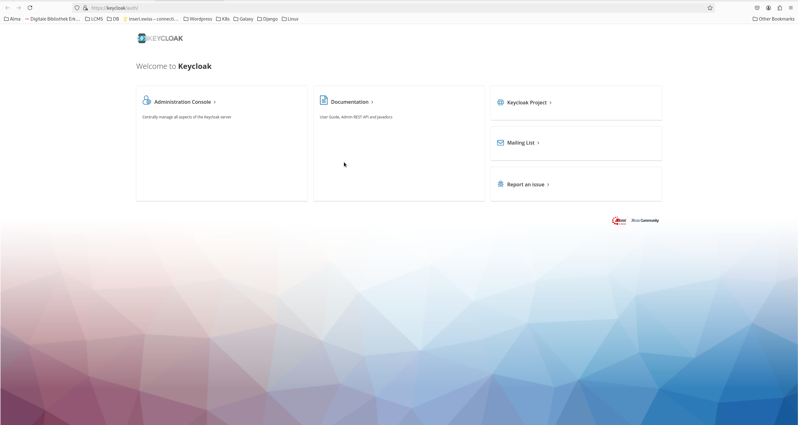
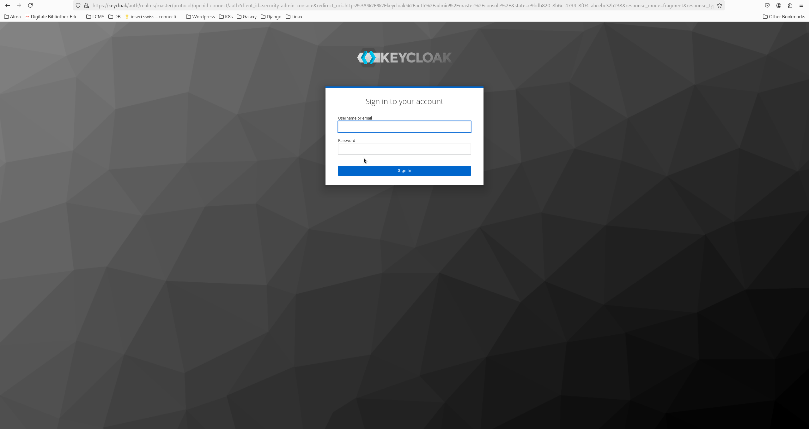
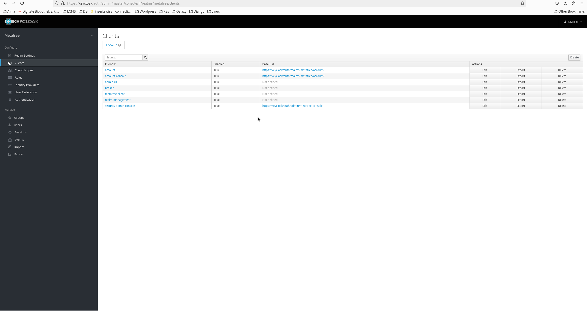
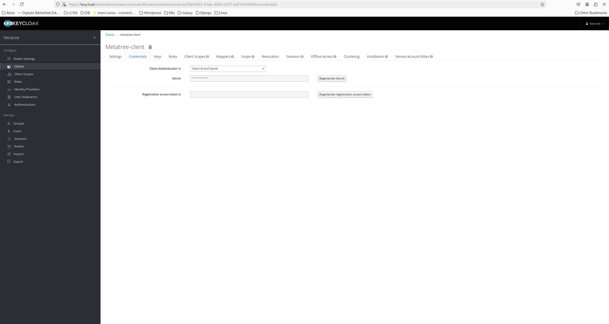
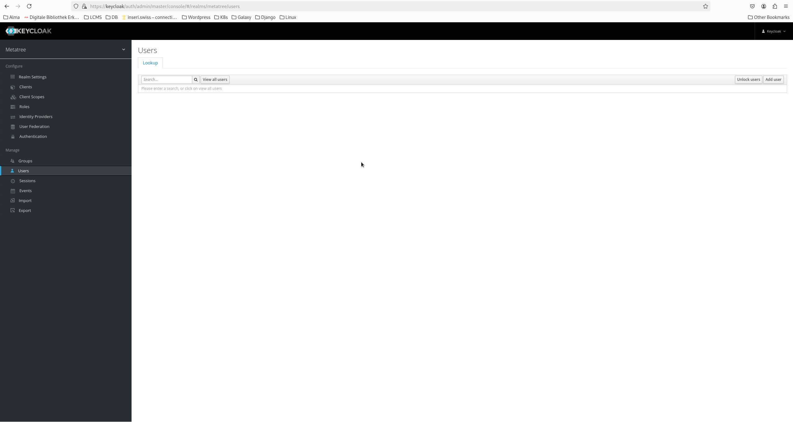
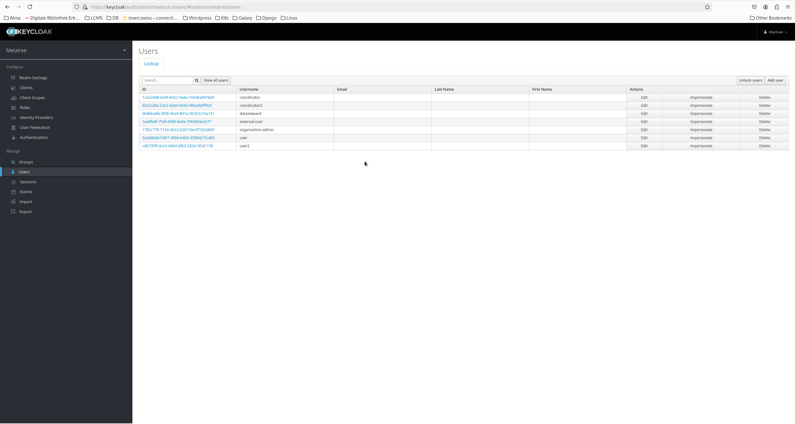
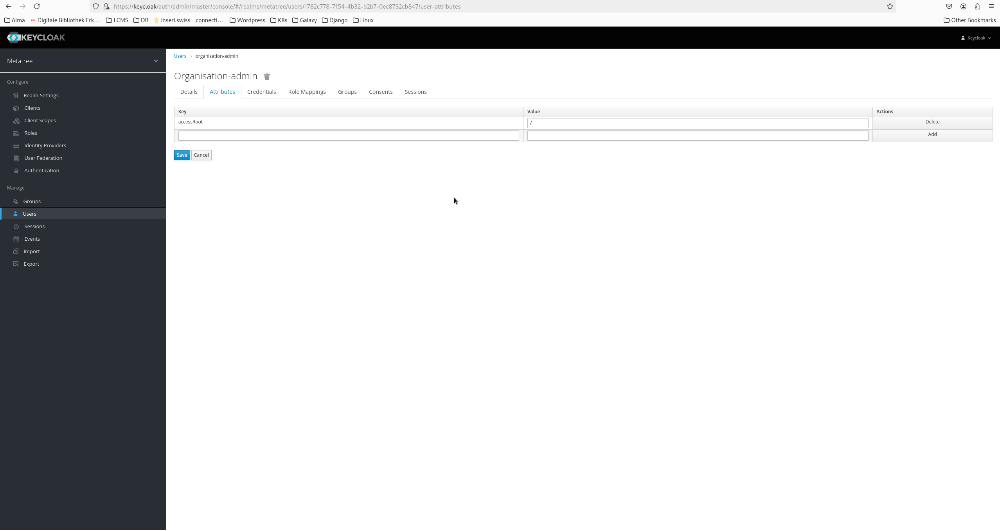
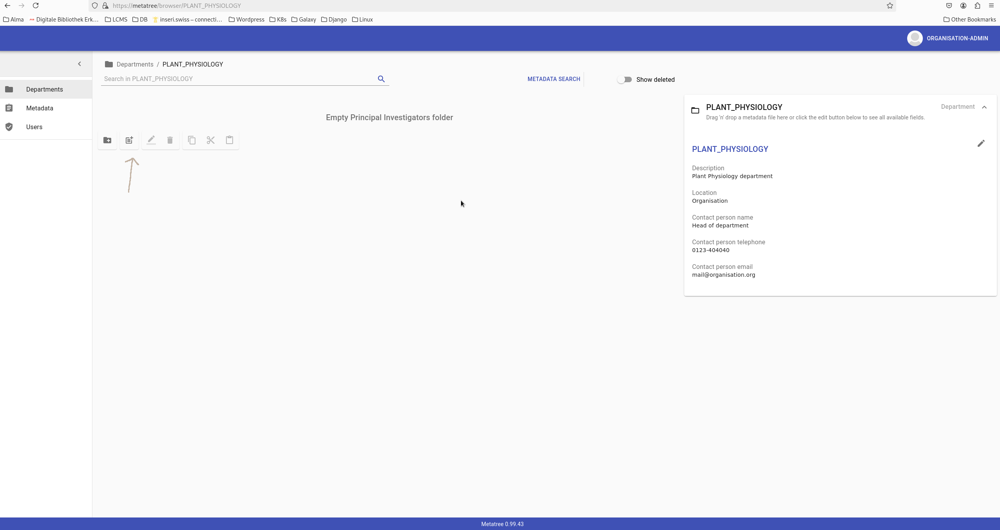

# Steps for configuration of metatree in docker containers

1. It is assumed that no reverse-proxy is running. If it is, please stop it for testing purposes.

2. Add two entries in the /etc/hosts file that point to 127.0.0.1 (need root privileges):
   ```bash
   sudo bash -c 'cat >> /etc/hosts <<EOF
   127.0.0.1 metatree keycloak
   EOF'
   ```
This will allow you to access the metatree and keycloak services via the hostnames metatree and keycloak.

3. Change to the docker directory and run start_all.sh
   ```bash
   cd docker
   ./start_all.sh
   ```
   This script creates self-signed certificates necessary for the nginx conainer,  download the docker images and start the containers. 

4. After the containers are started, login in the keycloak service and re-create the secret. You can access keycloak service via https://keycloak. Because the certificates are self-signed, you need to accept the warning in your browser. 

5. Select administration console

6. Login to keycloak with the following credentials:
   ```
   username: keycloak
   password: keycloak
   ```


7. Select clients from the left menu and open metatree-client


8. Select the tab "Credentials" and click on the "Regenerate Secret" button. This will create a new secret for the metatree-client. Copy the secret 


9. Open the docker/.env file and replace the old secret with the new one. The line should look like this:
   ```
   KEYCLOAK_CLIENT_SECRET=your_new_secret
   ```
    You can also use the following command (in the docker directory) to replace the secret in the .env file:
    ```bash
    sed -i "s/^KEYCLOAK_CLIENT_SECRET=.*/KEYCLOAK_CLIENT_SECRET=your_new_secret/" .env
    ```
## To limit the write access to specific folders, for each user the attribute accessRoot has to be set.

10. First open the Users menu on the left-side and click "view all users"


11. Select the user "organisation-admin" and click on the "Attributes" tab

12. Add the attribute "accessRoot" and set the value to the folder you want to limit the access to. For example, if you want to limit the access to the folder "test", set the value to "/test". You can also set multiple values by separating them with a comma. For example, if you want to limit the access to the folders "test" and "test2", set the value to "/test,/test2". To allow the admin to have global access, set the value to "/". This will allow the admin to write/access all folders.



## To allow the changes to take effect, you need to stop and start the containers again.
13. In the docker directory, run the following command to stop and remove the containers:
    ```bash
    ./stop_all.sh
    ```

14. Run the following command to start the containers again:
    ```bash
    ./start_all.sh
    ```
15. After the containers are started, you can access the metatree service via https://metatree. Because the certificates are self-signed, you need to accept the warning in your browser. You can login with the following credentials:
   ```
   username: organisation-admin
   password: fairspace123
   ```

## To initialize the database and upload the different schemas, cd into the **init** directory. This directory contains a python scipt that populates the database with the various ontology options according to the schema defined by the vocabulary file in the **docker** folder.

16. Update the KEYCLOAK_CLIENT_SECRET entry in the  **.env** file with the new secret you generated in step 9. Use the following command (in the docker directory) to replace the secret in the .env file:
    ```bash
    sed -i "s/^KEYCLOAK_CLIENT_SECRET=.*/KEYCLOAK_CLIENT_SECRET=your_new_secret/" .env
    ```
17. Run the following command (in the init folder) to run the init script:
    ```bash
    python3 initialize_db.py --env ./env
    ```

## **uploading_data** directory

For demonstration puroposes an Excel files can be found in the **uploading_data** directory. This file contains example meta data for a Plant physiology department. The label for this deparment is PLANT_PHYSIOLOGY and should first be created in metatree before uploading the data.

To upload the data select move into the PLANT_PHYSIOLOGY department you just created and upload the Excel file by clicking on the "Upload" button, the second from the left 



Furthermore information about the uploading process can be found in the [metatree documentation](uploading_data/Uploading_Metadata.pdf)


